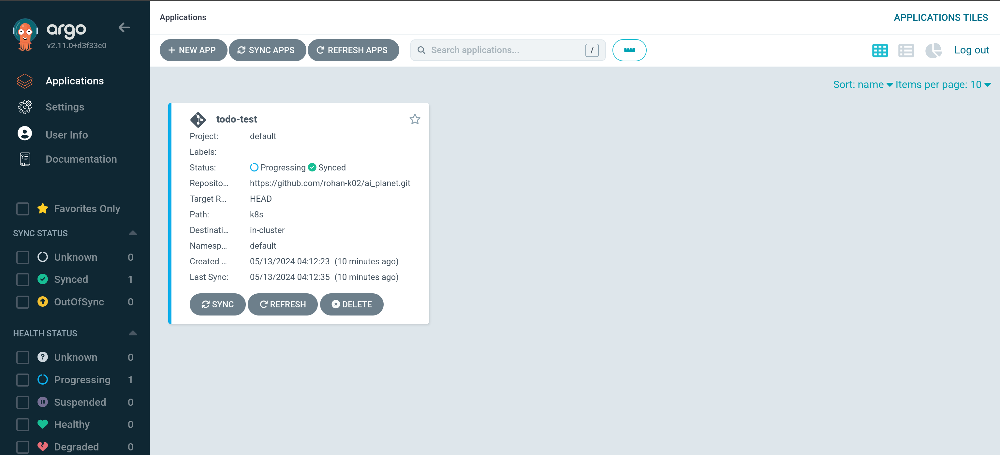
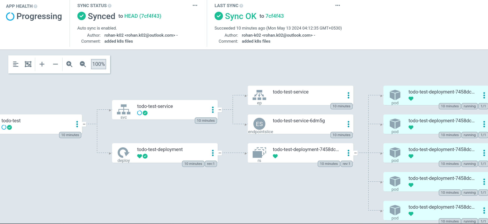
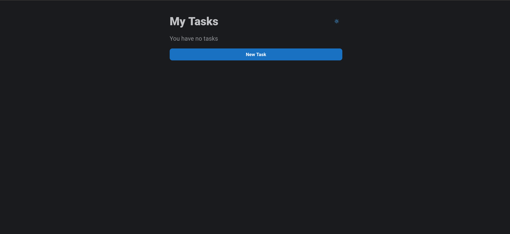

# ai_planet

This repo contains the web app source code, the dockerfile, and the k8s files along with the documentation.

## Task 1: Setup and Configuration

- Will not go into details for installing Argo CD and Argo Rollouts as the steps are as simple as running two commands.

## Task 2: Creating the GitOps Pipeline

### 1. Dockerize the Application

- Used a basic [to-do list app](https://github.com/javascriptbear/todo_react_app?tab=readme-ov-file) built with React. Credtits to  [javascriptbear](https://github.com/javascriptbear).
- Create a [Dockerfile](./Dockerfile) to build an image and containerize the app.
- Run the bash command to build the docker image. The tag name corresponds to the Docker Hub username and repository. The blue tag is given first to demonstrate the canary release strategy later.

    ```bash
    docker build . -t unspecialfx/todo_test:blue
    ```

- Push the docker image to Docker Hub

    ```bash
    docker push unspecialfx/todo_test:blue
    ```

### 2. Deploy the Application Using Argo CD

- Create a [deploment.yaml](./k8s/deployment.yaml) file in the k8s folder. This file specifies the number of replicas to be used by the container. The container will pull the docker image from the registry.

- Create a [service.yaml](./k8s/service.yaml) file in the k8s folder. This file facilitates network connection to the web app therefore the ports need to configured correctly.

- Forward Argo CD ports to enable GUI and CLI login.

    ```bash
    kubectl port-forward svc/argocd-server -n argocd 8080:443
    ```

- Login by getting the initial password and running the login command

    ```bash
    argocd admin initial-password -n argocd
    argocd login 127.0.0.1:8080
    ```

- Create an Argo CD application to monitor the repository and automatically deploy changes to the Kubernetes cluster.

    This command creates an app called todo-test that monitors the specified repo. It looks for kubernetes yaml files in the k8s folder. It uses the default namespace and connects to the local Kubernetes cluster.

    ```bash
    argocd app create todo-test --repo https://github.com/rohan-k02/ai_planet.git --path k8s --dest-namespace default --dest-server https://kubernetes.default.svc --sync-policy auto
    ```

- Verify the deployment by checking the Argo CD Web UI

    
    

- Open the app with the command `minikube service todo-test-service`

    

## Task 3: Implementing a Canary Release with Argo Rollouts

### Define a Rollout Strategy

- Create a new file called [rollout.yml](./k8s/rollout.yaml) in the k8s folder to specify the rollout strategy.

- Create a new file called [rollout-service.yml](./k8s/rollout-service.yaml).

- Apply the rollout and its service

    ```bash
    kubectl apply -f ./k8s/rollout.yaml
    kubectl apply -f ./k8s/rollout-service.yaml
    ```

- Verify the rollout by either using the GUI or CLI commands

    ```bash
    kubectl argo rollouts dashboard
    ````

    

### Trigger a rollout

- Modify the [app.js](./app/src/App.js) to display "All Tasks" instead of "My Tasks". Build a new Docker image with the "green" tag and push it to Docker Hub.

- Update the rollout

    The command below creates a canary deployment, according to spec.strategy.canary in the above rollout yaml file.

    ```bash
    kubectl argo rollouts set image todo-test-rollout \
    todo-test=unspecialfx/todo_test:green
    ```

### Monitor the Rollout

- Watch the rollout using CLI

    ```bash
    kubectl argo rollouts get rollout todo-test-rollout --watch
    ```

    

    

- Promote the Rollout either by pressing the GUI button or using CLI

    ```bash
    kubectl argo rollouts promote todo-test-rollout
    ```

    

Agro Rollout watches for changes in rollout object, and try to apply new version and apply new version with selected strategy (eg. canary, blue/green).

- Forward a port from a Revision 2 Pod to check the application.

    ```bash
    kubectl port-forward pod/todo-test-rollout-5d99b7b76f-47d54 28015:3000
    ```

    

The app now displays "All Tasks" instead of "My Tasks".

## Task 4: Documentation and Cleanup

### Cleanup

- Delete Argo CD Resources

    ```bash
    kubectl delete -n argocd deploy -l app.kubernetes.io/name=argocd
    kubectl delete -n argocd svc argocd-server argocd-server-metrics argocd-repo-server argocd-dex-server
    kubectl delete -n argocd ingress argocd-server-ingress
    ```

- Delete Argo Rollouts Resources

    ```bash
    kubectl delete -n argo-rollouts deploy -l app.kubernetes.io/name=argocd-rollouts
    kubectl delete -n argo-rollouts svc argocd-rollouts-metrics
    ```

- Delete Application Resources

    ```bash
    kubectl delete -f k8s/
    ```

## References

1. [Argo CD Docs](https://argo-cd.readthedocs.io/en/stable/)
2. [Argo CD Starter Guide - Youtube](https://www.youtube.com/watch?v=JLrR9RV9AFA)
3. [Argo Rollout Docs](https://argo-rollouts.readthedocs.io/en/stable/)
4. [Argo Rollouts: Quick Guide to Concepts](https://codefresh.io/learn/argo-rollouts/)
